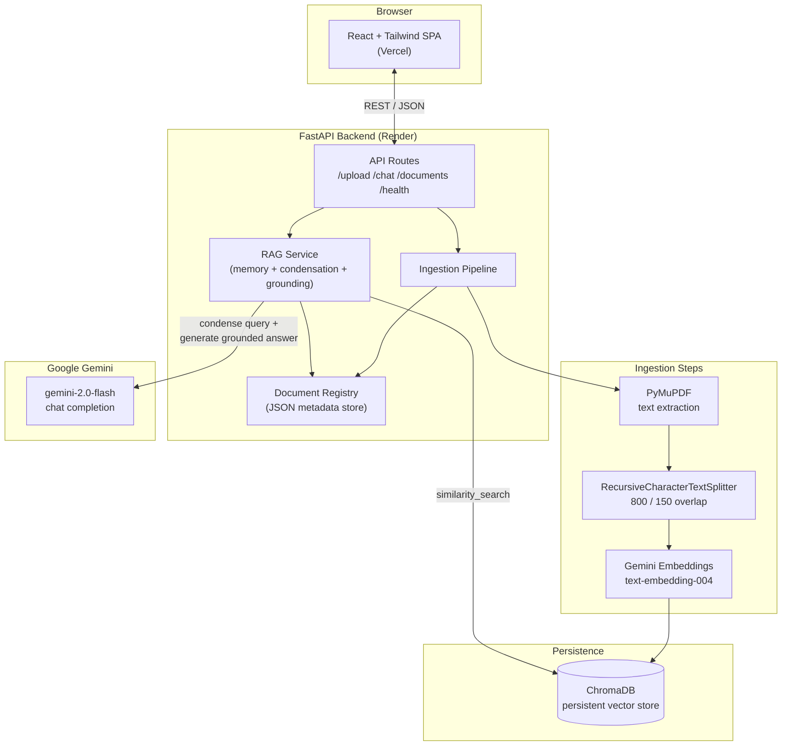

# OpsPilot

An internal document intelligence assistant. Upload PDFs (rate cards, SOPs, vendor
contracts, compliance circulars) and ask questions grounded strictly in their
contents — with page-level citations and conversational follow-ups.

Built for the VANCO AI technical assignment.

---

## Live Demo

- **App:** `<add your deployed Vercel URL here>`
- **API:** `<add your deployed Render URL here>`
- **API docs (Swagger):** `<Render URL>/docs`

---

## Architecture



**Request flow for a chat message:**
1. Frontend sends `{ message, session_id, document_ids }` to `POST /api/chat`.
2. RAG service pulls the last few turns for that `session_id` from in-memory history.
3. If there's history, the LLM rewrites the message into a standalone search query (so "and who does it apply to?" becomes something embeddable on its own).
4. The standalone query is embedded and matched against Chroma, scoped to the selected/ready document IDs.
5. Retrieved chunks are assembled into a context block; the LLM is instructed to answer **only** from that context and to say plainly when it can't.
6. The answer, its grounding flag, and citations (filename + page number) are returned together.

---

## Setup

### Prerequisites
- Python 3.12+
- Node.js 20+
- A free Google Gemini API key: https://aistudio.google.com/apikey

### Backend

```bash
cd backend
python -m venv venv
source venv/bin/activate        # Windows: venv\Scripts\activate
pip install -r requirements.txt

cp .env.example .env
# edit .env and set GOOGLE_API_KEY

uvicorn app.main:app --reload --port 8000
```

The API is now at `http://localhost:8000`, docs at `http://localhost:8000/docs`.

> Live inference requires a valid Google API key with available quota. If the key is missing or quota is exhausted, the backend now returns a clear 429-style message instead of surfacing a raw provider error.

> Set `GOOGLE_API_KEY` in `backend/.env` or as an environment variable before starting the backend. The app now resolves configuration from the backend project root, so the key is picked up consistently from local runs and deployment environments.

### Frontend

```bash
cd frontend
npm install

cp .env.example .env
# edit .env: VITE_API_BASE_URL=http://localhost:8000

npm run dev
```

The app is now at `http://localhost:5173`.

### One-command local run (Docker Compose)

```bash
export GOOGLE_API_KEY=your_key_here
docker compose up --build
```

Frontend on `http://localhost:5173`, backend on `http://localhost:8000`.

---

## Environment Variables

**Backend** (`backend/.env`, see `backend/.env.example`)

| Variable | Purpose | Default |
|---|---|---|
| `GOOGLE_API_KEY` | Gemini API key (required) | — |
| `GEMINI_CHAT_MODEL` | Chat model | `gemini-2.0-flash` |
| `GEMINI_EMBEDDING_MODEL` | Embedding model | `models/text-embedding-004` |
| `UPLOAD_DIR` | Temp storage for incoming PDFs | `data/uploads` |
| `CHROMA_PERSIST_DIR` | Chroma persistence path | `data/chroma_db` |
| `CHUNK_SIZE` / `CHUNK_OVERLAP` | Chunking parameters | `800` / `150` |
| `RETRIEVAL_TOP_K` | Chunks retrieved per query | `5` |
| `MAX_FILE_SIZE_MB` | Upload size limit | `50` |
| `CORS_ALLOWED_ORIGINS` | Comma-separated origins, or `*` | `*` |

**Frontend** (`frontend/.env`, see `frontend/.env.example`)

| Variable | Purpose |
|---|---|
| `VITE_API_BASE_URL` | Base URL of the deployed backend (no trailing slash) |

No secrets are committed anywhere in this repo — both `.env` files are gitignored, and only `.env.example` templates are checked in.

---

## Chunking Strategy

Chunking happens **per page**, not on the concatenated document, so every chunk
keeps an accurate `page_number` in its metadata — this is what makes citations
possible without a second lookup pass.

`RecursiveCharacterTextSplitter` (size **800**, overlap **150**, ~19%) was chosen because:

- It tries paragraph → sentence → word boundaries in order, so chunks stay
  semantically coherent instead of splitting mid-sentence.
- 800 characters (~150–200 tokens) is small enough to keep retrieval precise
  (a chunk about "penalty clauses" doesn't get diluted by three unrelated
  paragraphs) but large enough to preserve local context — e.g. a clause
  number defined one sentence above the amount it refers to.
- The ~19% overlap reduces the chance that a fact gets awkwardly severed
  right at a chunk boundary.

This is a solid default for dense, prose-heavy operational documents (SOPs,
contracts, circulars). It is **not** tuned for tables or highly structured
rate cards — see Known Limitations.

## Retrieval Strategy

Retrieval is dense-vector similarity search over Chroma (cosine distance,
Gemini embeddings), top-`k=5` by default, optionally filtered to a
user-selected subset of `document_ids`.

For conversational follow-ups, the raw user message is **not** embedded
directly — a cheap LLM call first condenses the last few turns + the new
message into a standalone query ("and who does it apply to?" → "Who does the
penalty clause in the vendor SOP apply to?"). This meaningfully improves
recall on follow-ups, since embedding a bare pronoun-only question retrieves
poorly on its own.

Grounding is enforced at the prompt level: the system prompt instructs the
model to answer only from the retrieved context and to return an exact,
detectable "could not find this information" string when it can't — the
backend checks for that string to set the `grounded` flag returned to the
frontend, which renders unfound answers in a visually distinct style and
without citation chips.

**Not implemented (see stretch goals below):** hybrid BM25+dense retrieval or
a reranking step. With `k=5` and page-scoped chunks, dense-only retrieval was
sufficient for the documents this was tested against; it's the first thing
worth revisiting with more time.

---

## API Reference

| Method | Path | Purpose |
|---|---|---|
| `POST` | `/api/upload` | Upload one or more PDFs (`multipart/form-data`, field `files`) |
| `POST` | `/api/chat` | Send a chat message (`message`, `session_id`, optional `document_ids`) |
| `GET` | `/api/documents` | List all uploaded documents and their status |
| `DELETE` | `/api/documents/{document_id}` | Remove a document and its vectors |
| `GET` | `/api/health` | Liveness + config check (LLM key present, vector store reachable) |

Full interactive schema at `/docs` (Swagger) once the backend is running.

---

## Deployment

### Backend → Render
1. Push this repo to GitHub.
2. New → Blueprint → point at the repo; Render will read `backend/render.yaml`.
3. Set the `GOOGLE_API_KEY` secret in the Render dashboard (it's marked `sync: false` in the blueprint, so it must be entered manually).
4. Render builds the Docker image and exposes `/api/health` as the health check path.

### Frontend → Vercel
1. New Project → import the repo, set **root directory** to `frontend`.
2. Framework preset: Vite (auto-detected via `vercel.json`).
3. Add environment variable `VITE_API_BASE_URL` = your Render backend URL.
4. Deploy.

---

## Known Limitations

- **Conversation memory is in-process.** Session history lives in a Python
  dict inside the running backend instance. It does not survive a restart
  and would not work correctly across multiple horizontally-scaled replicas.
  Fine for a single-instance pilot; a real deployment would move this to
  Redis or a database.
- **Document registry is a JSON file**, not a real database. Simple and
  sufficient for a pilot with dozens of documents; would not scale or
  handle concurrent writes safely at higher volume.
- **Citations are chunk-level, not sentence-level.** All chunks retrieved
  for a query are shown as citations, even if the final answer only really
  drew on one or two of them. Good enough to verify an answer quickly, but
  not a precise "this exact sentence came from this exact source" mapping.
- **No OCR.** Scanned/image-only PDFs will correctly fail with a clear
  "no extractable text" error rather than silently producing empty results,
  but they aren't processed.
- **No hybrid retrieval or reranking yet** — see Retrieval Strategy above.
- **No streaming tokens yet.** The architecture supports it (the LLM call is
  isolated in `llm_service.py`), but the current implementation returns the
  full answer in one response rather than token-by-token.
- **Free-tier Render disks are ephemeral on some plans** — if the deployed
  instance is on a plan without a persistent disk, the vector store and
  document registry will reset on redeploy. The `render.yaml` requests a
  persistent disk mount for `/app/data` to avoid this.

## What I'd Build Next With One More Week

1. **Streaming responses** — swap the single `llm.invoke()` call for
   `llm.stream()` and have the frontend render tokens as they arrive; the
   service boundary is already there.
2. **Hybrid retrieval** — add BM25 alongside the dense search and a light
   reranking step, and actually A/B the answer quality against dense-only
   on a held-out question set instead of assuming it helps.
3. **Move session memory and the document registry to Postgres** (or
   Postgres + pgvector, dropping Chroma) so the app can run multiple
   replicas and survive restarts cleanly.
4. **Sentence-level citation grounding** — post-process the answer to
   highlight which specific retrieved sentence(s) support each claim,
   instead of attaching all retrieved chunks as citations.
5. **Basic auth / multi-tenant support** — right now there's no user
   separation; anyone with the URL sees everyone's documents. A real ops
   team deployment needs at least a shared password gate, ideally per-user
   or per-team document scoping.
6. **Table-aware chunking** for rate cards — the current splitter treats
   tabular data as prose, which likely hurts retrieval on structured rate
   sheets specifically.

---

## Tech Stack

**Backend:** FastAPI, Python 3.12, LangChain (text splitting), ChromaDB, PyMuPDF, Google Gemini (chat + embeddings)
**Frontend:** React (Vite), Tailwind CSS, Axios
**Deployment:** Render (backend, Docker), Vercel (frontend)

## Project Structure

```
opspilot/
├── backend/
│   ├── app/
│   │   ├── api/routes/       # upload, chat, documents, health
│   │   ├── core/             # exceptions, logging
│   │   ├── models/           # pydantic schemas
│   │   ├── services/         # pdf, chunking, vectorstore, registry,
│   │   │                       ingestion, llm, rag orchestration
│   │   ├── utils/            # file validation helpers
│   │   ├── config.py
│   │   └── main.py
│   ├── requirements.txt
│   ├── Dockerfile
│   ├── render.yaml
│   └── .env.example
├── frontend/
│   ├── src/
│   │   ├── components/       # Sidebar, ChatWindow, MessageBubble, etc.
│   │   ├── services/api.js   # Axios client
│   │   ├── App.jsx
│   │   └── main.jsx
│   ├── Dockerfile
│   ├── vercel.json
│   └── .env.example
├── docker-compose.yml
└── PROJECT_PROGRESS.md
```
